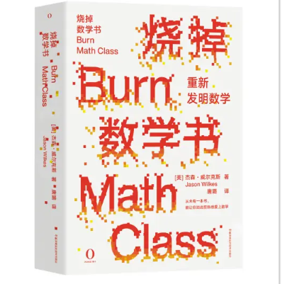

# 欢迎阅读我的第一篇文章

这是我的第一篇 Hexo 博客文章

# 我心中的高数

初中第一次接触高数是因为一本书《烧掉数学书：重新发明数学》。我的数学一直苦于计算——这和我从三年级开始偷懒用计算器脱不开关系。所以，我对这本标题上就狂放不羁的书产生了兴趣。书中通过作者与读者的对话，用“放大机器”“自乘机器”等引入了积分、导数，可以说让我对高数有了一定的，比较直观的理解。

在高中的物理学习中，许多概念衍生可以涉及积分，比如变加速运动中求速度需要对加速度积分、一些连续带电体的电场分布需要积分，简谐振动的位移公式用到微分方程推导……但我的能力不足以让我真正把积分、偏导数运用在解题中，通常我只大致的认识：这个“从天而降”的公式涉及了哪些用以推导的工具。

前些天，我尝试手动搭建一个神经网络用以了解AI的逻辑，然而我遇到的第一个结便是矩阵。我需要在传输算法中运用矩阵乘法来计算网络输出，然而我并不理解矩阵相乘如何转化为信息的输入输出量配置。

高数是什么呢？我想这是一个神奇的工具集，最主要的两把螺丝刀是积分与微分。

积分的思想是化整为零，再积零为整。最初我们用积分来测量面积，进而体积（卡瓦列里原理）；抽象后，我们推广到更高维空间的体积、质量。

微分的思想则是以直代曲，我们用它求得变化率、得出倾斜度，解决人口增长、热传导、振动等问题。

从天体运动到工程设计，从经济学模型到人工智能，微积分是描述它们的，最神奇的工具和语言。